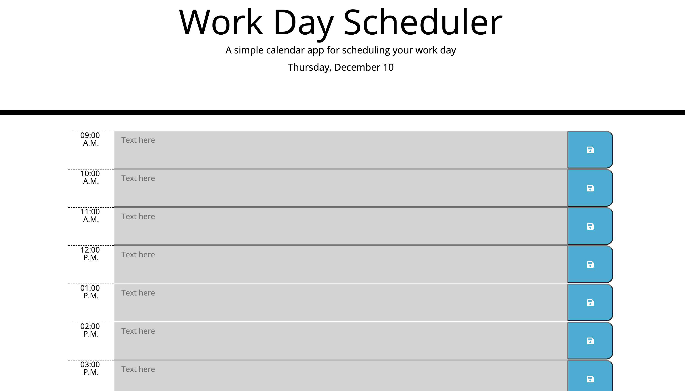

# Work Day Scheduler

##  Task

As a developer, I am being asked to create a simple calendar application that allows a user to save events for each hour of the day by modifying starter code. I will utilize Luxon The languages used will be ***HTML*** and ***CSS*** powered by ***jQuery*** and it will be powered in the browser. 

## How To Use Application
1. When user opens planner in browser, the current date will load and display at the top
2. When user scrolls down, they will be presented with time blocks for standard business hours (9am-5pm)
3. Each  time block is color-coded to indicate whether it is in the past, present, or future time
4. When user clicks into the text area of a time block, they are able to type "To Do" items in 
5. When user clicks the save icon, the text they types in the time block text area, will save in the local storage. 
6. When user refreshes the page, the stored "To Do" items will remain in the text area, as it is saved. 

## Screenshot of application

## Review

* https://itz-essie.github.io/Work-Day-Scheduler/

* https://github.com/itz-essie/Work-Day-Scheduler

